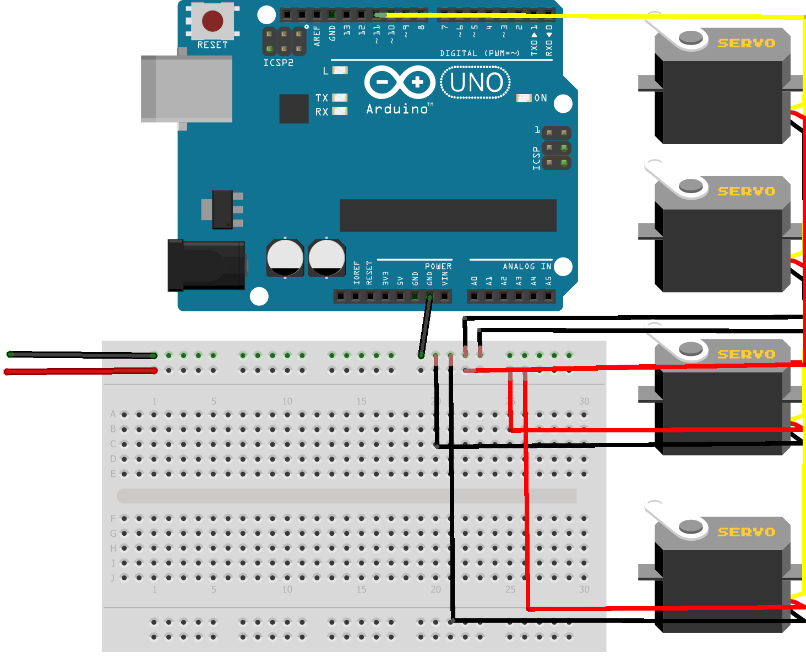

# ARM Robot CV - Hand Tracking Servo Control

A computer vision project that uses hand tracking to control servo motors on an Arduino board. The system tracks your index finger position in real-time and maps it to servo motor angles for precise robotic arm control.

## 🎯 Features

- **Real-time Hand Tracking**: Uses MediaPipe to detect and track hand landmarks
- **Index Finger Tracking**: Specifically tracks the index finger tip (landmark point 8)
- **Dual Servo Control**: Controls two servo motors (X and Y axes) simultaneously
- **Visual Feedback**: Displays hand landmarks, tracking lines, and servo angle values on screen
- **Live Video Feed**: Real-time camera feed with overlaid tracking information

## 📋 Prerequisites

### Hardware Requirements
- Arduino board (Uno, Nano, or compatible)
- 2x Servo motors (SG90 or similar)
- USB cable to connect Arduino to computer
- Webcam or built-in camera
- Jumper wires for connections

### Software Requirements
- Python 3.7 or higher
- Arduino IDE (for uploading Firmata firmware)
- Webcam drivers installed

## 🔧 Installation

### 1. Install Python Dependencies

Install the required Python packages:

```bash
pip install opencv-python mediapipe numpy pyfirmata
```

Or create a `requirements.txt` file and install:

```bash
pip install -r requirements.txt
```

### 2. Arduino Setup

#### Step 1: Install Firmata on Arduino

1. Open Arduino IDE
2. Go to **File → Examples → Firmata → StandardFirmata**
3. Select your Arduino board: **Tools → Board → [Your Board Type]**
4. Select the correct port: **Tools → Port → [Your Port]**
5. Click **Upload** to upload the Firmata sketch to your Arduino

#### Step 2: Connect Servo Motors

**Wiring Diagram:**



*Note: The diagram shows 4 servos as an example. For this project, you only need 2 servos connected to pins 9 and 10.*

**Connection Instructions:**

- **Servo X (Horizontal)**: Connect to **Digital Pin 9**
  - Red wire → 5V (or external power supply positive rail)
  - Black/Brown wire → GND (or external power supply negative rail)
  - Orange/Yellow wire → Pin 9

- **Servo Y (Vertical)**: Connect to **Digital Pin 10**
  - Red wire → 5V (or external power supply positive rail)
  - Black/Brown wire → GND (or external power supply negative rail)
  - Orange/Yellow wire → Pin 10

**Important Notes:**
- If using multiple servos, consider using an external power supply for the servos to avoid overloading the Arduino's 5V regulator
- Connect the external power supply's ground to Arduino GND for a common ground reference
- The diagram shows servos connected via a breadboard, which is recommended for easier wiring and power distribution
- Ensure all power connections are secure before powering on

## 📝 Configuration

### Update Arduino Port

Before running the script, you need to update the Arduino port in `HandController.py`:

1. **On macOS/Linux**: 
   - Open Terminal and run: `ls /dev/tty.*` or `ls /dev/cu.*`
   - Look for entries like `/dev/tty.usbmodem144101` or `/dev/cu.usbmodem144101`
   
2. **On Windows**:
   - Open Device Manager → Ports (COM & LPT)
   - Look for "Arduino" and note the COM port (e.g., COM3, COM4)
   - Use format: `"COM3"` or `"COM4"`

3. Update line 17 in `HandController.py`:
   ```python
   port = "/dev/tty.usbmodem144101"  # Change this to your port
   ```

### Camera Settings

The default camera resolution is set to 1280x720. You can modify these values in `HandController.py`:

```python
ws, hs = 1280, 720  # Width and Height
```

## 🚀 Usage

### Running the Application

1. **Connect Arduino**: Ensure your Arduino is connected via USB and Firmata is uploaded
2. **Connect Servos**: Verify servo connections to pins 9 and 10
3. **Run the Script**:
   ```bash
   python HandController.py
   ```

### How It Works

1. **Camera Initialization**: The script opens your default camera (index 0)
2. **Hand Detection**: MediaPipe processes each frame to detect hands
3. **Landmark Tracking**: When a hand is detected, it extracts 21 hand landmarks
4. **Index Finger Tracking**: Tracks landmark point 8 (index finger tip)
5. **Coordinate Mapping**: 
   - X position (0-1280) → Servo X angle (180-0 degrees)
   - Y position (0-720) → Servo Y angle (0-180 degrees)
6. **Servo Control**: Sends angle commands to Arduino via PyFirmata

### Visual Display

The application window shows:
- **Hand Landmarks**: Cyan-colored dots and connections showing hand structure
- **Index Finger Marker**: Magenta circle at the index finger tip
- **Tracking Lines**: Black crosshair lines following the finger
- **Coordinate Display**: Finger position coordinates near the marker
- **Servo Angles**: Yellow box showing current servo angles in degrees

### Controls

- **Press 'q'**: Quit the application and close all windows

## 📁 Project Structure

```
ARM-ROBOT-CV/
│
├── HandController.py      # Main Python script for hand tracking and servo control
├── ArduinoFirmata.ino     # Arduino Firmata code (StandardFirmata from Arduino IDE)
├── arduino_linking.png    # Wiring diagram for Arduino and servo connections
├── requirements.txt       # Python dependencies
└── README.md              # This file
```

## 🔍 Code Explanation

### HandController.py

#### Key Components:

1. **MediaPipe Setup** (Lines 6-8):
   - Initializes hand detection with 80% confidence threshold
   - Configures drawing utilities for visualization

2. **Arduino Connection** (Lines 16-20):
   - Connects to Arduino via PyFirmata
   - Sets up servo control pins (9 for X-axis, 10 for Y-axis)

3. **Main Loop** (Lines 22-76):
   - Captures video frames
   - Processes hand detection
   - Extracts index finger coordinates (landmark 8)
   - Maps coordinates to servo angles
   - Sends commands to Arduino

#### Coordinate Mapping:

- **Servo X**: Maps X position from left (0) to right (1280) → Servo angle from 180° to 0°
- **Servo Y**: Maps Y position from top (0) to bottom (720) → Servo angle from 0° to 180°

This creates an intuitive control where moving your finger right moves the servo left, and moving down moves the servo up.

### ArduinoFirmata.ino

The Arduino code uses the StandardFirmata library, which allows the Arduino to be controlled remotely via serial communication. This eliminates the need for custom Arduino code - PyFirmata handles all the servo control commands.

**Key Features**:
- Receives servo angle commands from Python
- Controls servos on pins 9 and 10
- No custom code needed - StandardFirmata handles everything

## 🐛 Troubleshooting

### Common Issues

1. **"Serial port not found" or "Could not find port"**
   - Check Arduino is connected via USB
   - Verify the port name in `HandController.py` matches your system
   - Try unplugging and replugging the Arduino

2. **Camera not opening**
   - Check camera permissions
   - Try changing camera index: `cv2.VideoCapture(1)` instead of `cv2.VideoCapture(0)`
   - Ensure no other application is using the camera

3. **Servos not moving**
   - Verify Firmata is uploaded to Arduino
   - Check servo connections (power, ground, signal)
   - Ensure servos are receiving adequate power
   - Check if servos work by testing with Arduino IDE servo examples

4. **Hand not detected**
   - Ensure good lighting
   - Keep hand clearly visible in frame
   - Check camera focus
   - Try adjusting `min_detection_confidence` value (line 8)

5. **Erratic servo movement**
   - Add delays between servo writes (not currently implemented)
   - Check for loose connections
   - Ensure stable power supply

## 🔧 Customization

### Adjust Detection Sensitivity

Change the confidence threshold in line 8:
```python
hands = mpHand.Hands(min_detection_confidence=0.8)  # Lower = more sensitive
```

### Change Servo Pins

Modify lines 19-20 to use different pins:
```python
servo_pinX = board.get_pin('d:9:s')   # Change 9 to desired pin
servo_pinY = board.get_pin('d:10:s')  # Change 10 to desired pin
```

### Invert Servo Direction

To reverse servo direction, swap the interpolation ranges:
```python
servoX = int(np.interp(px, [0, ws], [0, 180]))  # Inverted
servoY = int(np.interp(py, [0, hs], [180, 0]))  # Inverted
```

### Track Different Finger

Change landmark index in line 49:
- 4: Thumb tip
- 8: Index finger tip (current)
- 12: Middle finger tip
- 16: Ring finger tip
- 20: Pinky tip

## 📚 Dependencies

- **opencv-python**: Computer vision and video processing
- **mediapipe**: Hand detection and landmark tracking
- **numpy**: Numerical operations and interpolation
- **pyfirmata**: Arduino communication via Firmata protocol

## 🤝 Contributing

Contributions are welcome! Please feel free to submit a Pull Request.

## 📄 License

This project is open source and available for educational and personal use.

## 🙏 Acknowledgments

- MediaPipe by Google for hand tracking technology
- PyFirmata for Arduino communication
- OpenCV community for computer vision tools

## 📞 Support

If you encounter any issues or have questions:
1. Check the Troubleshooting section above
2. Review the code comments in `HandController.py`
3. Ensure all dependencies are correctly installed
4. Verify Arduino Firmata is properly uploaded

---

**Note**: This project is designed for educational purposes. Ensure proper safety precautions when working with motors and electrical components.

